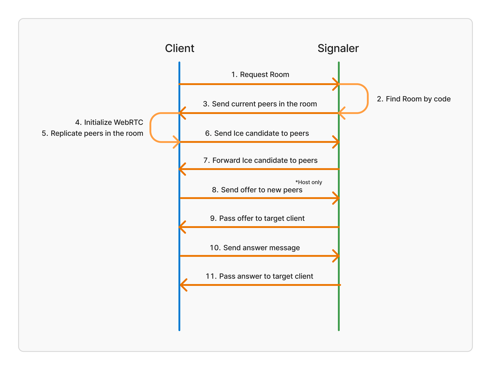

# Introduction to PackRTC

Welcome to the documentation for PackRTC! PackRTC is an easy P2P multiplayer solution for Godot. It provides WebRTC signaling for code based multiplayer rooms. Great for games intended to be played with friends.

## How it works
PackRTC works with signaler. PackRTC handles WebRTC messages, while the signaler helps keep the state of peers in the game, and passes messages to the right peer.

Here's a diagram showing how PackRTC works:

